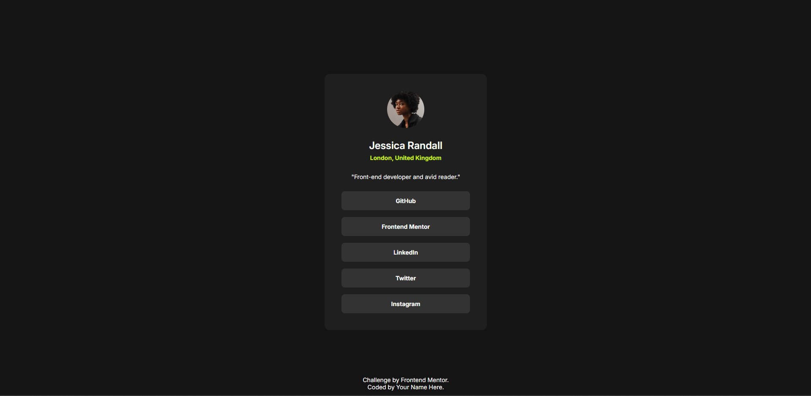

# Social Links Profile Component

## Table of contents

- [Overview](#overview)
  - [The challenge](#the-challenge)
  - [Screenshot](#screenshot)
  - [Links](#links)
- [My process](#my-process)
  - [Built with](#built-with)
  - [What I learned](#what-i-learned)
  - [Continued development](#continued-development)
  - [Useful resources](#useful-resources)
- [Author](#author)
- [Acknowledgments](#acknowledgments)

---

## Overview

### The challenge
The task was to create a social profile card with:
- A profile picture, name, and location.
- A brief description and a list of social media links.
- A design that is responsive and modern.

### Screenshot

### Links
- Live Site URL: [Add your live site URL here](https://github.com/adambeckercodes/fem-social-links-profile)
- Solution URL: [Add your solution repository URL here](#)

---

## My process

### Built with
- Semantic HTML5
- CSS custom properties for maintainable styles
- Flexbox for layout and alignment
- Responsive design principles

### What I learned
This project helped me practice:
1. Using **CSS variables** for colors, spacing, and typography to create a consistent and scalable design system.
2. Structuring **semantic HTML** for better accessibility and clarity.
3. Creating a **mobile-first responsive design**, ensuring the layout adapts well to smaller screens.

### Continued development
For future improvements, I want to focus on:
- Adding **responsiveness** for larger screens and experimenting with **CSS Grid**.
- Enhancing **hover effects** and interactive animations to make the design more dynamic.
- Incorporating **JavaScript** to dynamically update the card content.

### Useful resources
- [MDN Web Docs](https://developer.mozilla.org/) - For understanding semantic HTML and accessibility features.
- [CSS Tricks - Flexbox Guide](https://css-tricks.com/snippets/css/a-guide-to-flexbox/) - For building a flexible and responsive layout.
- [WebAIM Contrast Checker](https://webaim.org/resources/contrastchecker/) - To ensure color contrast meets accessibility standards.

---

## Author
- GitHub - [Dias Adambekov](https://github.com/adambeckercodes)
- Frontend Mentor - [@adambeckercodes](https://www.frontendmentor.io/profile/adambeckercodes)
- Twitter - [@adambeckercodes](https://x.com/adambeckercodes)

---

## Acknowledgments
Special thanks to the Frontend Mentor community for their guidance and feedback throughout this project! 😊
